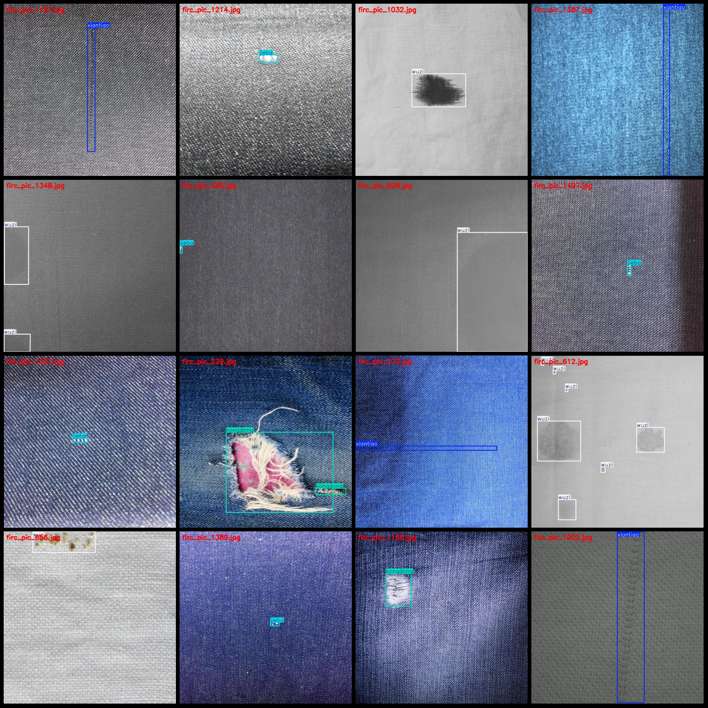
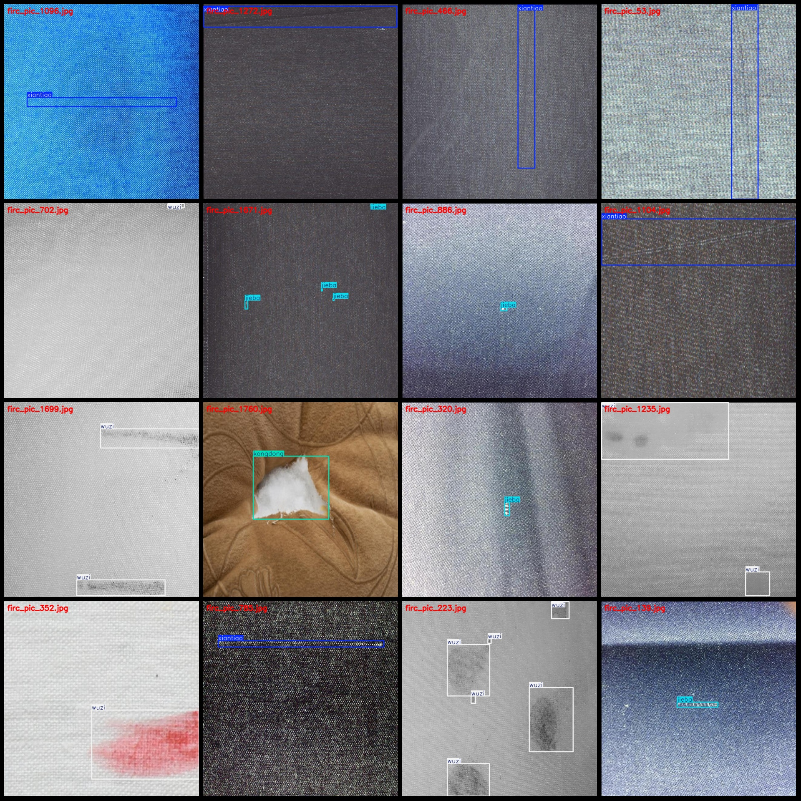

# Textile Factory Clothing Quality Inspection Data Set - Labeled Objects with Holes, Stains, Scars, and Roughness Detection

Please note that approximately 1000 images are original, the rest are enhanced. For a detailed view, please refer to the images.

Dataset format: Pascal VOC format + YOLO format (excluding the split path in the txt file, only containing jpg images, corresponding VOC format xml files, and yolo format txt files).

Number of images (jpg file count): 2006
Number of annotations (xml file count): 2006
Number of annotations (txt file count): 2006
Number of categories: 4
Category names as per the yolo format order may not match this, but refer to the labels folder's classes.txt for reference: ["jieba", "kongdong", "wuzi", "xiantiao"]
Corresponding Chinese category names: ["scar", "hole", "stain", "line"]
Box counts for each category:
jieba boxes = 671
kongdong boxes = 729
wuzi boxes = 777
xiantiao boxes = 658
Total boxes = 2835
Number of images per category:
jieba images = 559
kongdong images = 480
wuzi images = 470
xiantiao images = 587
Image resolution: 640x640
Annotation tool used: labelImg
Annotation rules: Draw boxes around the categories
Important notice: The dataset does not have separate training, validation, or test sets; they need to be manually divided.
Special declaration: This dataset does not guarantee any accuracy on trained models or weight files.
Image previews:

## Images

Here is a pay link on Stripe ( https://buy.stripe.com/3cs8yP7sY87d0vu9AB ). Please contact me lonlonago@foxmail.com after funding $89, and I will send you a complete data files , thank you!

